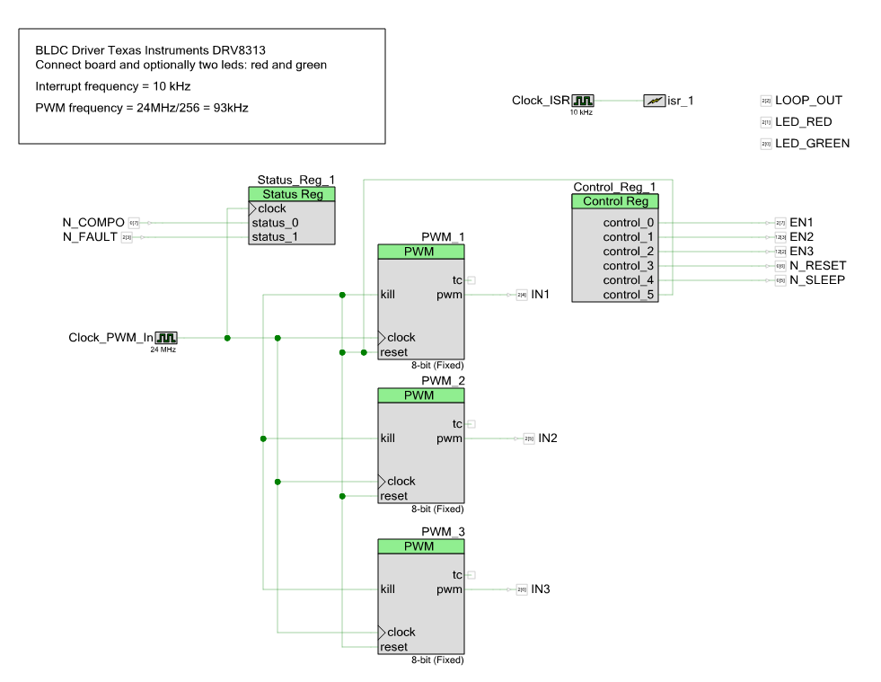

# Half Bridge Driver Board DRV8313

The board is a breadboardable breakout board for Texas Instruments DRV8313 IC.

The DRV8313 provides three individually controllable half-H-bridge drivers. The device is intended to drive a three-phase brushless-DC motor, although it can also be used to drive other loads. 
It has built-in thermal protection and indicates errors by a fault pin. Also built-in comparator can be used to check for certain current limit.

The board can be populated with additional larger capacitor to stabilize supply voltage if driving higher loads. Solder a capacitor to C6 with about 100µF then.

Folders:
  * PSoC5: simple example project which demonstrates how to use the DRV8313 board to drive BLDC motor using Cypress PSoC5 Kit. 
  * pins: contains ods file with pins and how they are connected to PSoC
  * datasheets: datasheet for DRV8313
  
Using this board with Arduino and other boards is possible but if PWM frequency is not high enough you might hear sound from motor generated by slow PWM.

Schematic

Psock Top Design

